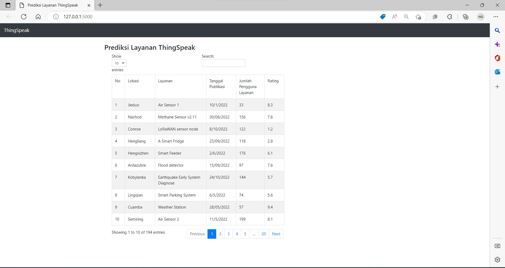

# Tugas Besar II3120 Layanan STI
# Manajemen Prediksi Layanan ThingSpeak

## Cara Menjalankan Aplikasi
1. Ubah data database Postgresql pada `mainr.py` sesuaikan dengan host,nama, user, dan password dari Postgresql lokal Anda.
2. Import `ThingSpeak.sql` ke database lokal pengguna atau dapat melakukan import file csv ke database postgresql melalui pgAdmin 4.
3. Install requirements.txt dengan menjalankan printah `pip install -r requirements.txt`
3. Jalankan program `main.py` dengan menjalankan perintah `py main.py` pada *command prompt*.
4. Jika berhasil dijalankan, maka akan terdapat link yang muncul di terminal.
5. Buka link tersebut.

## Cuplikan Tampilan 


## Tabel Basis Data
* Tabel Layanan
```
      Column       |       Type        | Collation | Nullable | Default
-------------------+-------------------+-----------+----------+---------
 no                | integer           |           | not null |
 lokasi            | character varying |           |          |
 layanan           | character varying |           |          |
 tanggal_publikasi | character varying |           |          |
 jumlah_pengguna   | integer           |           |          |
 rating            | double precision  |           |          |
```
